# Exercise 2: Build a lakehouse

##### **Estimated Duration: 90 minutes**

In this exercise, you will activate SharePoint Online to enable cloud-based collaboration and storage services for the required tasks. You will create a lakehouse in Microsoft Fabric, which serves as a centralized repository for both structured and unstructured data. Then, you will ingest sample data into the lakehouse to prepare it for analysis using the Delta table format. Afterwards, you will build and save a report using Power BI to visualize insights from the ingested data. Finally, you will utilize Microsoft Fabric’s integration to perform end-to-end data workflows, demonstrating the combination of data engineering, analytics, and reporting in a single platform.

## Lab objectives

- Task 1: Activate SharePoint Online
- Task 2: Create a lakehouse
- Task 3: Ingest sample data
- Task 4: Build a report

## Task 1: Activate SharePoint Online

**Objective:** Activate SharePoint Online by signing into the Office homepage.

1. To activate SharePoint Online, copy the **Office homepage link** and open this link inside the VM in a new tab.

   ```
   https://office.com
   ```

2. Click on **Sign in (1)**.

   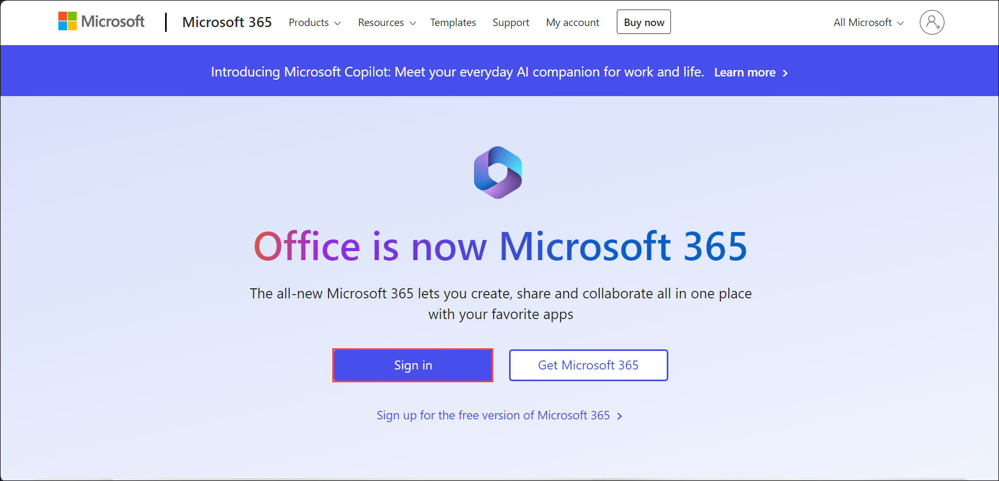

3. If you see the prompt **Action Required**, click on **Ask Later**.

   

4. You have now successfully signed into **Office homepage** and activated **SharePoint Online**.

   

   >**Note:** This will be required for Task 3 in the lab.

5. You can now close this tab and proceed to the next task.

## Task 2: Create a lakehouse

**Objective:** Create a lakehouse within Microsoft Fabric to manage and analyze data.

1. From the newly created Power BI workspace, make use of the **Experience switches (1)** located at the bottom left, and select **Data Engineering (2)**.

   

2. In the **Data Engineering** tab, select **Lakehouse** to create a lakehouse.

   .png)

3. If Prompted then click on **Upgrade** tab.

    

4. In the **New lakehouse** dialog box, enter **wwilakehouse (1)** in the **Name** field, and click on **Create (2)** to create and open the new lakehouse.

   .png)

   > **Congratulations** on completing the task! Now, it's time to validate it. Here are the steps:
   > - If you receive a success message, you can proceed to the next task.
   > - If not, carefully read the error message and retry the step, following the instructions in the lab guide. 
   > - If you need any assistance, please contact us at cloudlabs-support@spektrasystems.com. We are available 24/7 to help you out.
 
   <validation step="98c90546-5680-4978-b3ae-eb32a2422fdc" />

## Task 3: Ingest sample data

**Objective:** Load sample data into the lakehouse for processing and analysis.

1. In the **Lakehouse Explorer**, you see options to load data into Lakehouse. Select **New Dataflow Gen2**.

   

2. On the new dataflow pane, select **Import from a Text/CSV file**.

   

3. On the **Connect to data source (1)** pane, select the **Upload file (Preview) (2)** radio button, and then click on **Browse (3)**.

   

4. In the Open window, navigate to the **C:\FabricFiles (1)** folder, select the **dimension_customer.csv (2)** file, and click on **Open (3)**.

     

5. After the file is uploaded, select **Next**.

   .png)

   >**Note:** The **Preview file data** page might require a few minutes to load.

6. From the **Preview file data** page, preview the data and select **Create** to proceed and return back to the dataflow canvas.
   
   

7. It will open up a **Power Query** editor. In the **Query settings (1)** pane, verify whether **dimension_customer (2)** is reflected under the **Name** field. 

   

8. Now, we will be removing the pre-configured **Data destination** and configuring it manually, click on the **X** next to the Lakehouse icon under **Data destination**.

   

9. It will open up a prompt which will ask you to confirm to **Remove data destination**, and click on **OK**.

   
   
10. Now, in the **Query (1)** editor, click on **Add data destination (2)**, and select **Lakehouse (3)**.

    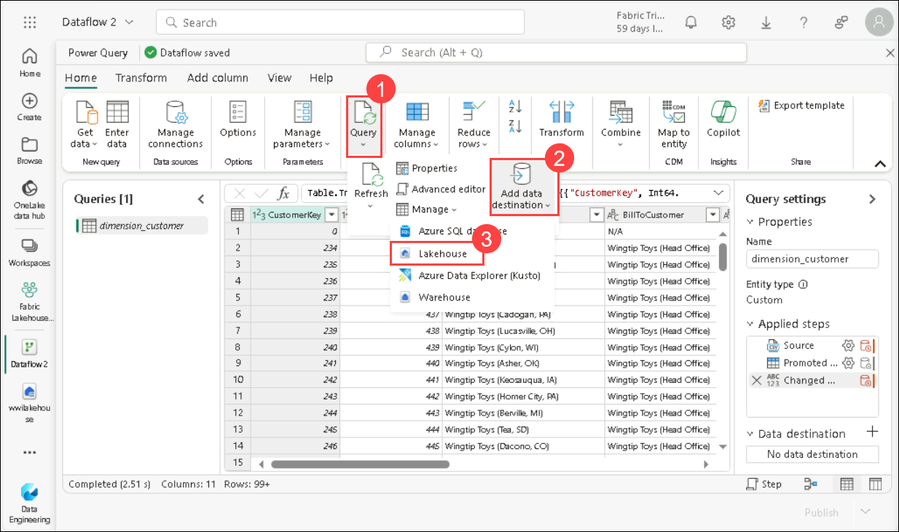

11. In the **Connect to data destination** pane, confirm the **Connection**, and click on **Next**.

    .png)

12. In the **Choose destination target** pane, confirm the name of the table to be **dimension_customer (1)**. Now, expand your workspace select **wwilakehouse (2)**, and click on **Next (3)**.

    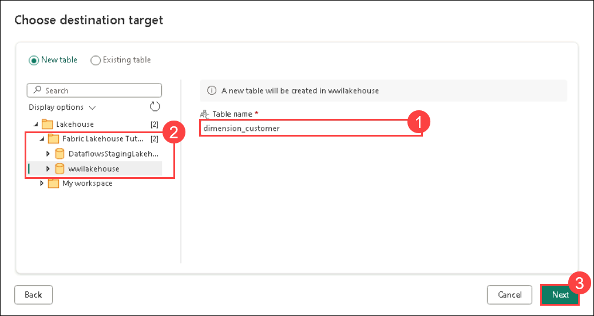 

14. In the **Choose destination settings**, select **Save Settings** to return to the dataflow canvas.

    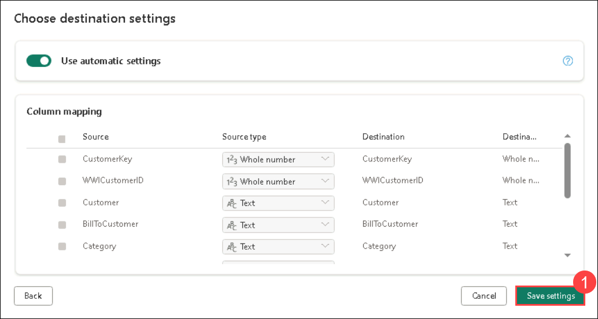

15. From the dataflow canvas, select **Publish** at the bottom right of the screen.

    

16. A spinning circle next to the dataflow's name indicates publishing is in progress in the item view.

    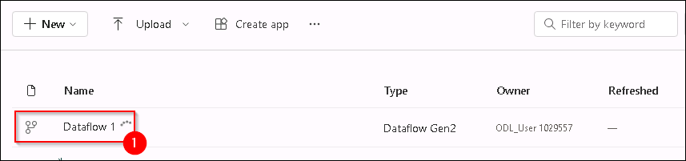

17. Once publishing is complete, click on the **...(1)** and select **Properties (2)**.

    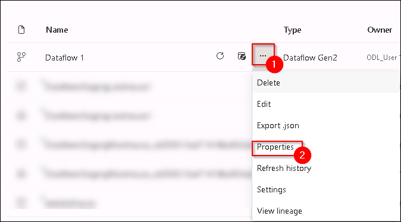

18. Rename the dataflow to **Load Lakehouse Table (1)** and select **Save (2)**.

    -T2.3-S17.png)

19. Select the **Refresh now** option next to the data flow name to refresh the data flow. It runs the dataflow and moves data from the source file to the lakehouse table.

    

20. Once the dataflow is refreshed, select your lakehouse from the **Fabric workspace**.

    

21. Now, you can view the **dimension_customer** delta table. Select the table to preview its data.

    >**Note**: If you are unable to view _dimension_customer_ delta table, please refresh the page.

    

23. You can also use the SQL analytics endpoint of the lakehouse to query the data with SQL statements. Select **SQL analytics endpoint** from the Lakehouse drop-down menu at the top right of the screen.

      

24. Select **New SQL query** to write your SQL statements.

    

25. Input the following SQL query which aggregates the row count based on the BuyingGroup column of the **dimension_customer** table.

    ```
    SELECT BuyingGroup, Count(*) AS Total
    FROM dimension_customer
    GROUP BY BuyingGroup
    ```

26. Click on **Run** to run the query, and view the results.

    

## Task 4: Build a report

**Objective:** Create a report using Power BI based on the ingested data.

1. Select your lakehouse from the **Fabric workspace**.

    

2.  Open your lakehouse and switch to the **SQL analytics endpoint** view.

    

3. Previously all the lakehouse tables and views were automatically added to the semantic model. With recent updates, for new lakehouses, you must manually add your tables to the semantic model. From the **Reporting (1)** tab, select **Manage default semantic model (2)** and select the tables that you want to add to the semantic model. In this case, select the **dimension_customer (5)** table under **dbo (3)** > **Tabels (4)**, Click on **Confirm (6)**

   

5. To ensure that the tables in the semantic model are always in sync, switch to the **SQL analytics endpoint**, Click on **...** to get setting options. 

   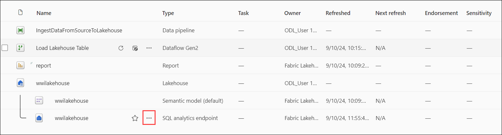

6. Open the **Settings** pane.

   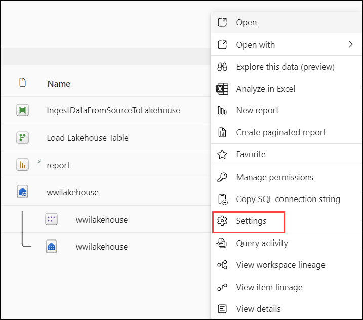

7. Select **Default Power BI semantic model** and **turn on** Sync the default Power BI semantic model.

   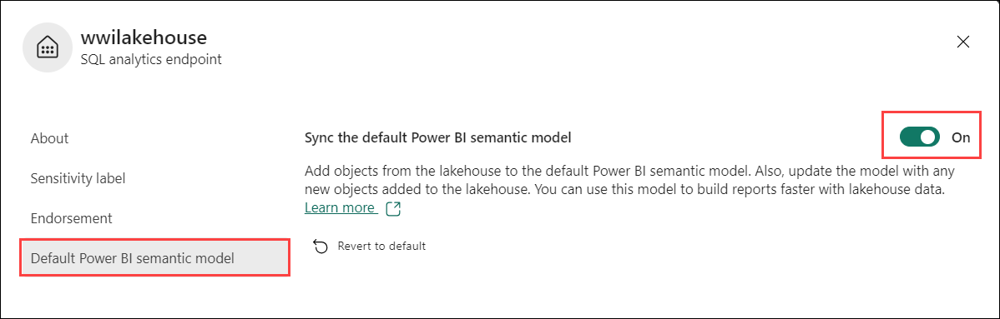

8. From the workspace, select the **wwilakehouse Semantic model**. 

   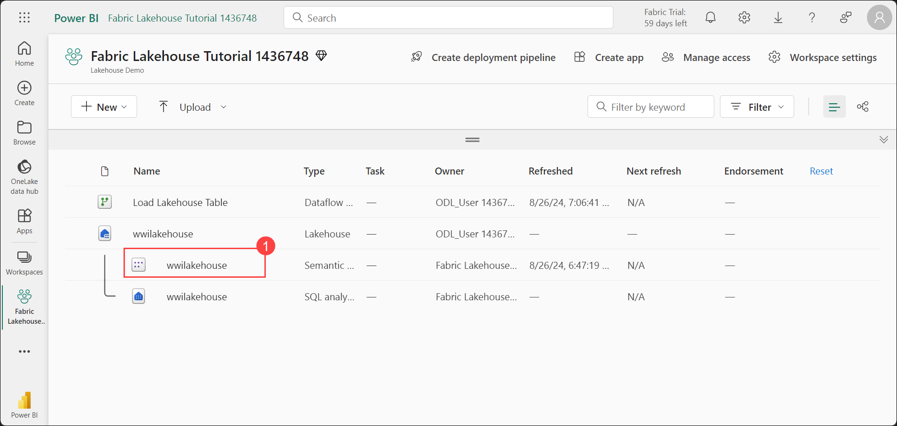

9. From the dataset pane, you can view all the tables. You have options to create reports either from scratch, paginated reports or let Power BI automatically create a report based on your data. For this lab, select **Explore this data (1)** and click on **Auto-create a report (2)**.

   

10. Since the table is a dimension and there are no measures in it, Power BI creates a measure for the row count aggregates it across different columns, and creates different charts as shown in the following image. You can save this report for the future by selecting **Save** from the top ribbon.

    

11. Enter a name for your report **(1)** and click on **Save**.

    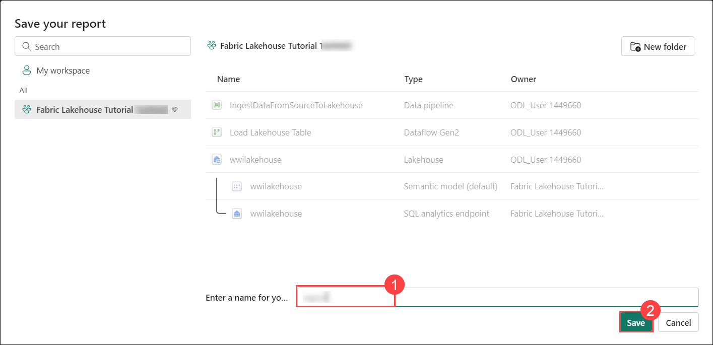

12. Your report will now be stored within the same Power BI workspace, ensuring that all your data and visualizations remain organized in one central location for easy access and management.

   > **Congratulations** on completing the task! Now, it's time to validate it. Here are the steps:
   > - If you receive a success message, you can proceed to the next task.
   > - If not, carefully read the error message and retry the step, following the instructions in the lab guide. 
   > - If you need any assistance, please contact us at cloudlabs-support@spektrasystems.com. We are available 24/7 to help you out.

## Review

In this exercise, you have:

- Activated SharePoint Online, ensuring that required cloud-based collaboration and storage services are available for specific tasks in the lab.

- Created a lakehouse in Microsoft Fabric, which serves as a centralized repository for structured and unstructured data, enabling efficient data organization and processing.

- Ingested sample data into the lakehouse, preparing the environment for further analysis and enabling data exploration using a Delta table format.

- Built and saved a report using Power BI, showcasing insights through visualizations by leveraging the ingested data and lakehouse structure.

- Utilized the seamless integration of Microsoft Fabric's components to perform end-to-end data workflows, demonstrating how data engineering, analytics, and reporting work together in a single platform.

Now, click on **Next** to proceed to the next exercise.
