# Exercise 3: Ingest data into the lakehouse

### Estimated Duration : 1 Hour

In this exercise, you ingest additional dimensional and fact tables from the Wide World Importers (WWI) into the lakehouse.

## Lab objective

- Task 1: Ingest data

## Task 1: Ingest data

1. Open/Navigate back to the **Fabric Workspace**, click on the **+ New (1)** button and select **Data pipeline (2)**.

   

2. In the **New pipeline** dialog box, specify the name as **IngestDataFromSourceToLakehouse (1)** and select **Create (2)**. A new data factory pipeline is created and opened.

   

3. On your newly created data factory pipeline, select **Copy data assistant (1)** to add an activity to the pipeline.

   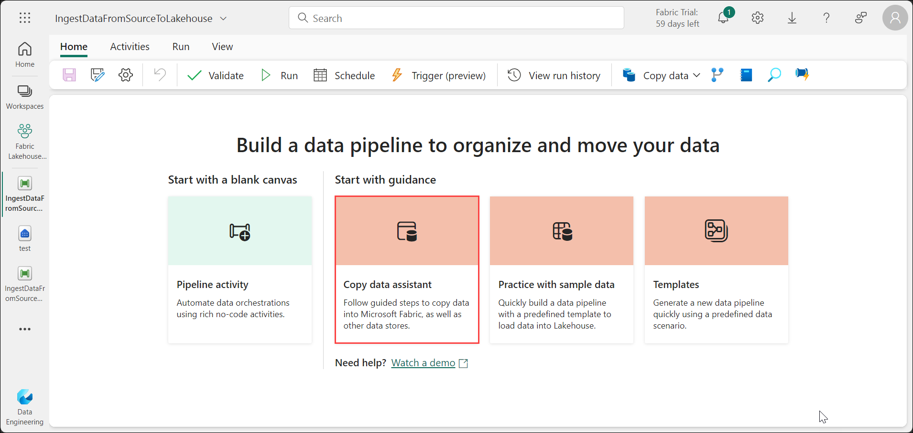

4. Next, set up an HTTP connection to import the sample World Wide Importers data into the Lakehouse. From the list of Choose data sources, search for **Http (1)** and select **Http (2)**.

   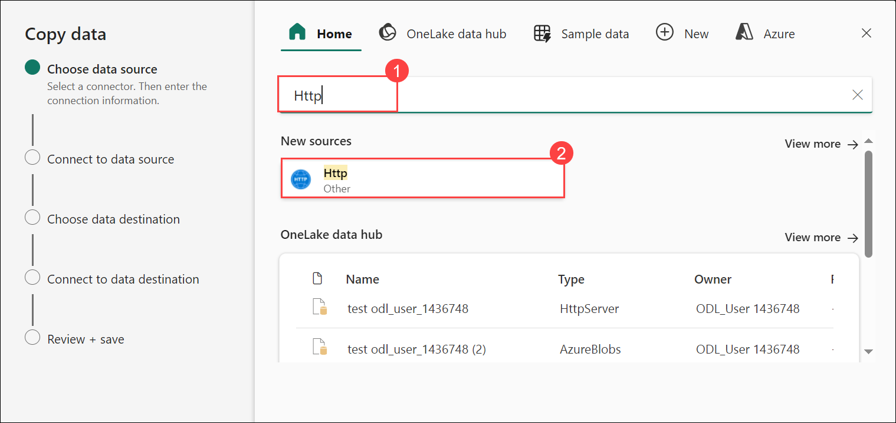

5. In the **Connect to data source** window, enter the details from the table below and select **Next**.

    | Property | 	Value |
    | -- | -- |
    | **URL** | `https://assetsprod.microsoft.com/en-us/wwi-sample-dataset.zip` |
    | **Connection** | **Create a new connection** |
    | **Connection name** | **wwisampledata** |
    | **Data gateway** | None |
    | **Authentication kind** | Anonymous |

   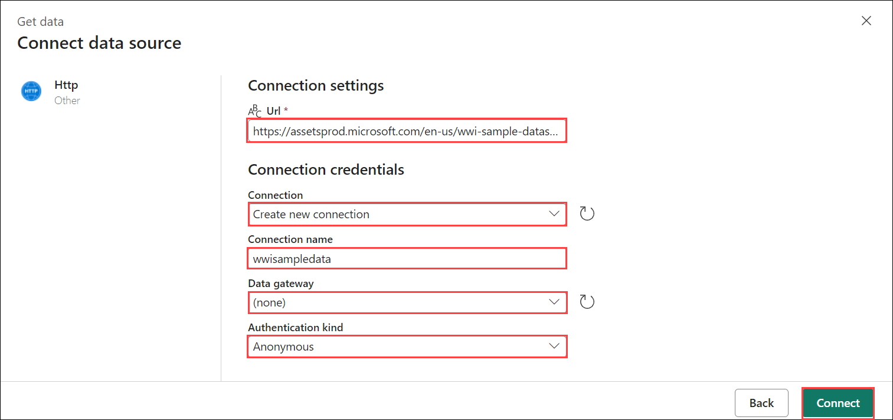

5. In the next step, enable the **Binary copy** and choose **ZipDeflate (.zip)** as the **Compression type** since the source is a .zip file. Keep the other fields at their default values and click **Next**.

   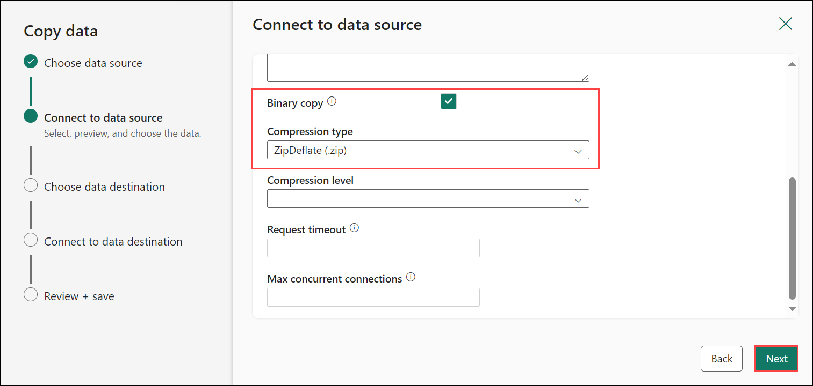

6. In **Choose data destination**, select your lakehouse as **wwilakehouse**.

   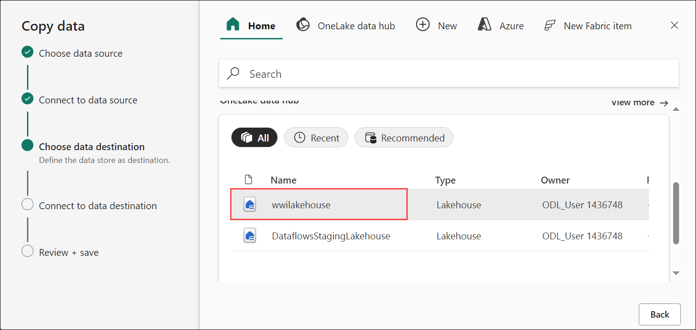

7. In the **Connect to data destination** window, specify the **Root folder** as **Files** and click **Next**. This will write the data to the Files section of the lakehouse.

   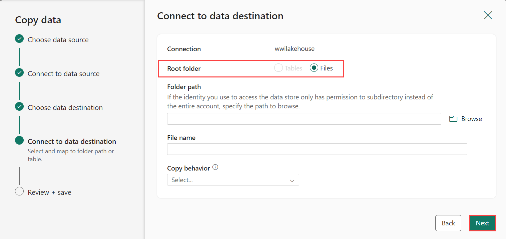

8. Choose the **File format** as **Binary** for the destination. Click **Next** and then **Save+Run**. You can schedule pipelines to refresh data periodically. In this tutorial, we only run the pipeline once. The data copy process takes approximately 10-15 minutes to complete.
 
   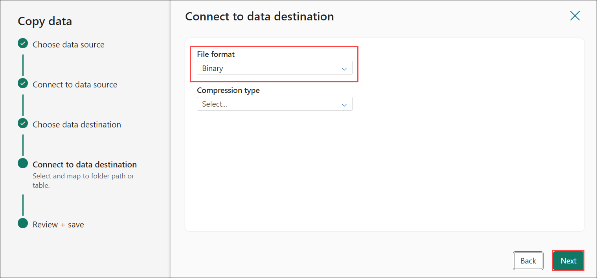

   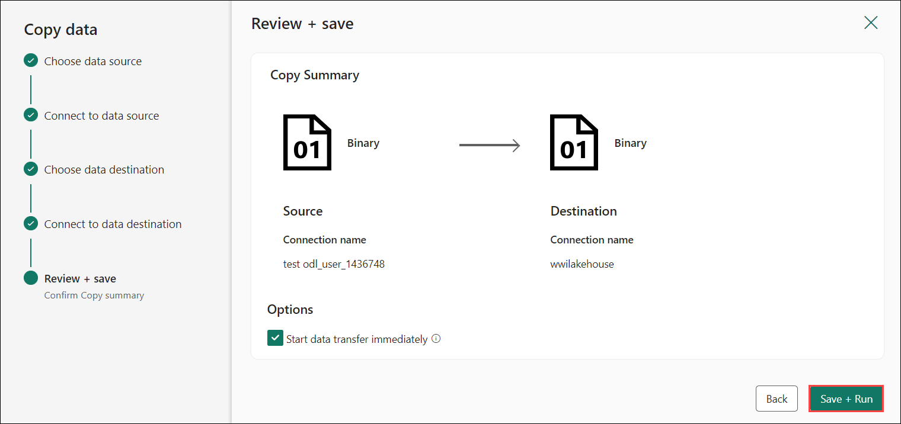

9. You can monitor the pipeline execution and activity in the Output tab. You can also view detailed data transfer information by selecting the glasses icon next to the pipeline name, which appears when you hover over the name

   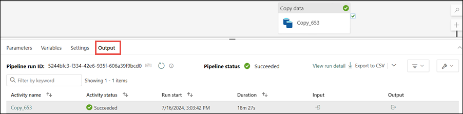

    >**Note**: The process will take up to 20 minutes to complete. 

11. Now, navigate back to **Fabric workspace** and select **wwilakehouse** to launch **Lakehouse explorer**.

    

12. Validate that in the Lakehouse Explorer view, a new folder **WideWorldImportersDW** has been created and data for all the tables have been copied there.

    >**Note**: Refresh the Files section from the drop down. 

    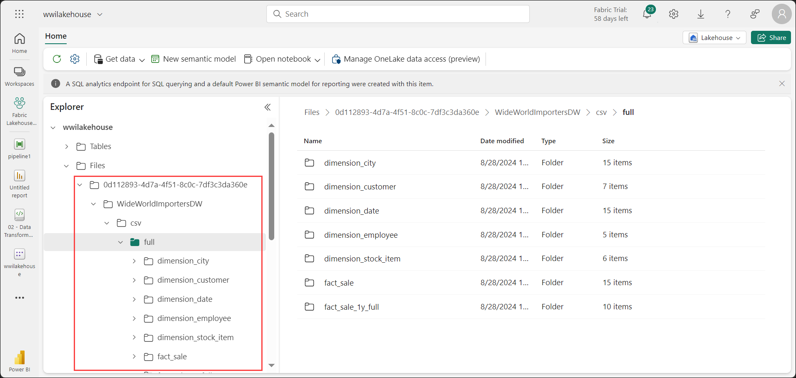

13. The data is created under the **Files** section of the lakehouse explorer. A new folder with GUID contains all the needed data. Rename the GUID to **wwi-raw-data**.

    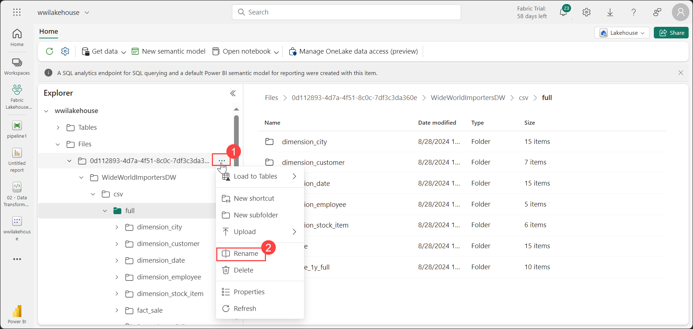

    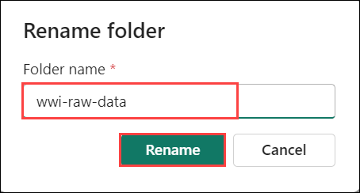

14. At this point, data for all the tables has been successfully copied into the **wwi-raw-data** folder.

> **Congratulations** on completing the task! Now, it's time to validate it. Here are the steps:
> - Hit the Validate button for the corresponding task. If you receive a success message, you can proceed to the next task. Alternatively, you can navigate to the Lab Validation Page, from the upper right corner in the lab guide section.
> - If not, carefully read the error message and retry the step, following the instructions in the lab guide. 
> - If you need any assistance, please contact us at labs-support@spektrasystems.com. We are available 24/7 to help you out.
 
   <validation step="97e3f082-96e0-4665-bdab-1a69221a56d9" />

## Summary

In this exercise, you have completed ingesting data to the lakehouse.

### You have successfully completed the lab >> Click on Next

