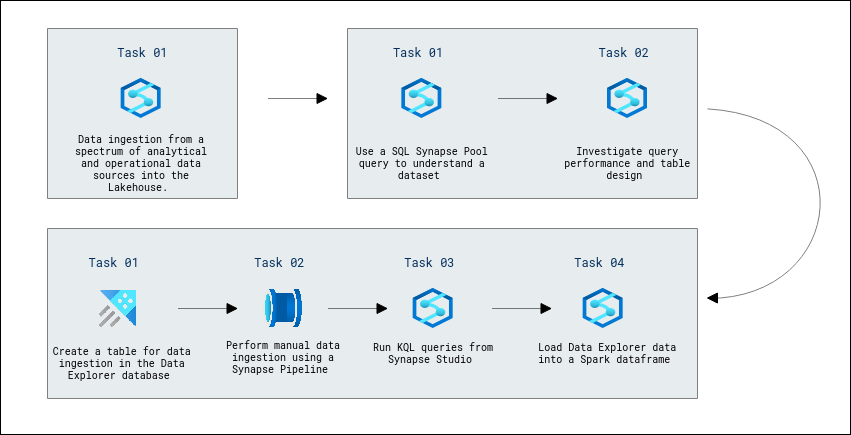
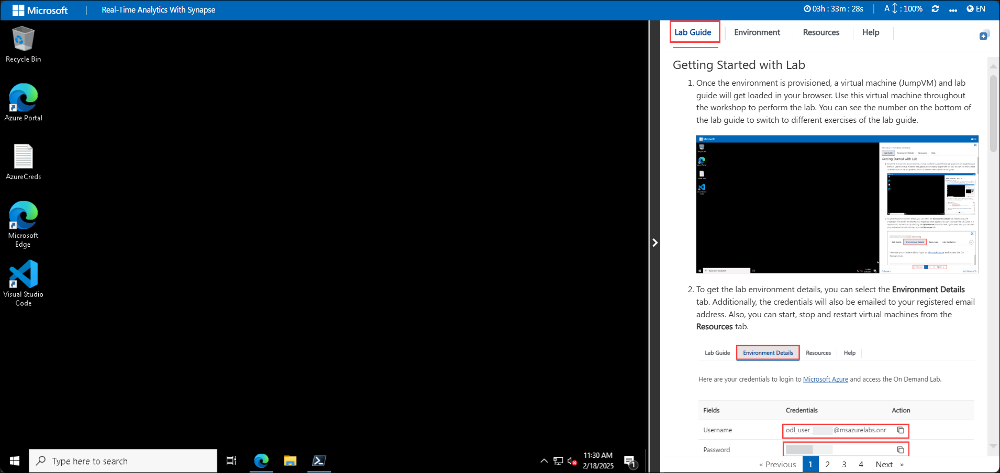
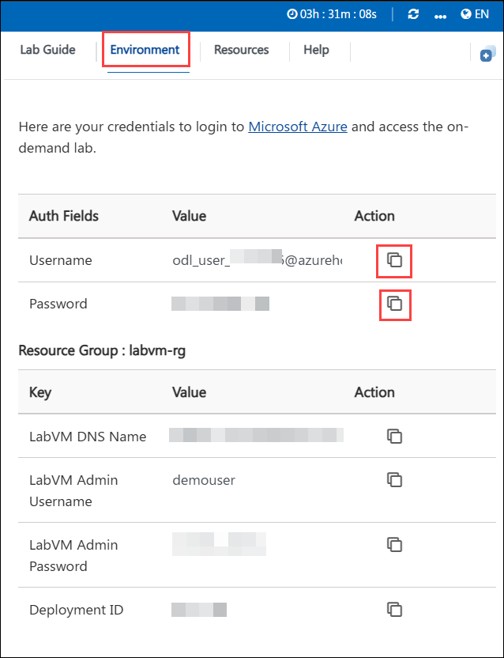
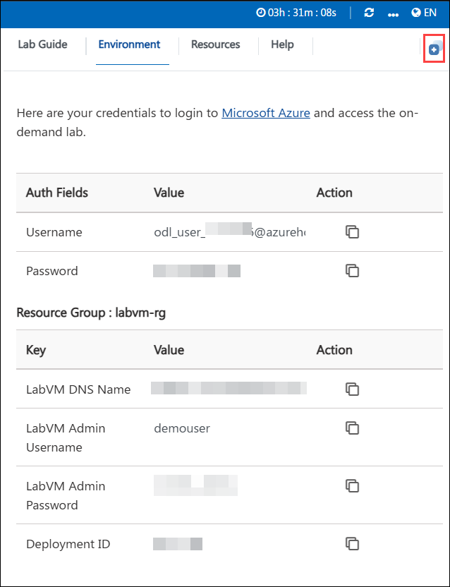
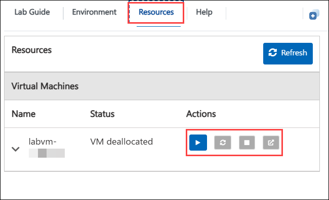
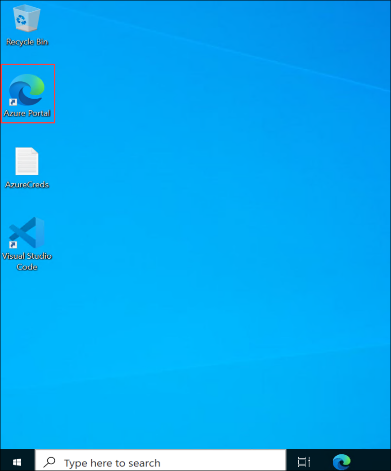
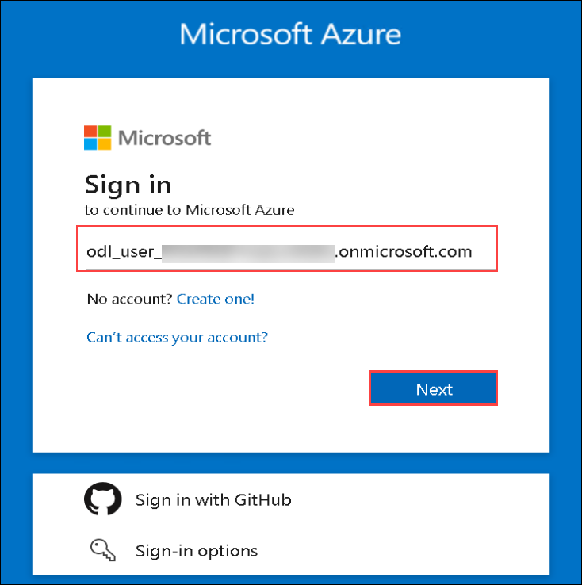
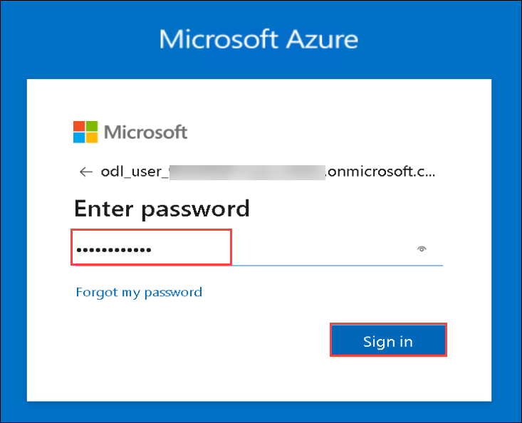

# Real Time Analytics with Synapse

### Overall Estimated Duration: 2 hours

## Overview

In this lab, you will explore real-time analytics capabilities using Azure Synapse. You will begin by ingesting data from various analytical and operational sources into the Lakehouse, enabling a unified data foundation. Next, you will perform high-performance analysis using Azure Synapse Dedicated SQL Pools to optimize query execution and enhance data processing. Finally, you will analyze logs and telemetry data to derive actionable insights, helping you monitor and optimize system performance. This lab provides hands-on experience in building a scalable and efficient real-time analytics solution with Azure Synapse.

## Objective

This lab provides hands-on experience in implementing real-time analytics using Azure Synapse. Participants will ingest data from various analytical and operational sources into the Lakehouse, perform high-performance analysis using Synapse Dedicated SQL Pools, and analyze log and telemetry data for actionable insights.

- **Data ingestion from a spectrum of analytical and operational data sources into the Lakehouse**: Load structured and unstructured data from multiple sources into Synapse Lakehouse.

- **High-Performance Analysis with Azure Synapse Dedicated SQL Pools**: Execute complex queries and optimize performance using Dedicated SQL Pools.

- **Analyze log and telemetry data for real-time insights**: Process and analyze log data to monitor system performance and detect anomalies.

## Prerequisites

Participants should have the following prerequisites:

- **Basic familiarity with Azure services**: Understanding of Azure Synapse Analytics, Data Lake Storage, and SQL-based querying.
- **Fundamental knowledge of data ingestion and processing**: Awareness of ETL (Extract, Transform, Load) concepts and real-time data processing.
- **Experience with SQL and analytics**: Ability to write and execute SQL queries for data analysis.
- **Access to an Azure Synapse Analytics workspace**: Ensure permissions to work with Lakehouse, Dedicated SQL Pools, and data ingestion pipelines.

## Architecture  

The real-time analytics solution with Azure Synapse enables seamless data ingestion, high-performance analysis, and real-time monitoring. Data from various sources is ingested into the Lakehouse using Synapse Pipelines or Azure Data Factory. The Lakehouse provides unified storage for structured and unstructured data, while Dedicated SQL Pools optimize query performance. Log and telemetry data are processed for real-time monitoring and anomaly detection, ensuring efficient data processing and actionable insights.

## Architechture Diagram

## Explanation of Components

The architecture for this lab involves several key components:

- **Azure Synapse Analytics**: A unified analytics platform that integrates data ingestion, transformation, and analysis using SQL pools, Spark pools, and Synapse Pipelines.
- **Azure Data Lake Storage**: A scalable storage solution for both raw and processed data, providing a central repository for data before loading it into Synapse.
- **Synapse Pipelines**: A data integration tool for automating ETL operations, facilitating seamless data movement from various sources into the Lakehouse.
- **Synapse Dedicated SQL Pools**: High-performance data processing components used for large-scale querying and optimized data analytics.
- **Log Analytics**: A tool that collects and analyzes telemetry data for real-time monitoring, anomaly detection, and performance tracking within Synapse workloads.
- **Synapse Studio**: A web-based interface used to manage and orchestrate Synapse resources, including Pipelines, SQL Pools, and data ingestion workflows.

## Getting Started with Lab

Welcome to the Real-time Analytics with Synapse Lab! In this lab, you’ll explore data ingestion into the Lakehouse, perform high-performance analysis with Synapse SQL Pools, and analyze log and telemetry data for insights. Let’s dive in and get hands-on with real-time analytics using Azure Synapse.

## Accessing Your Lab Environment

Once you're ready to dive in, your virtual machine and **Lab Guide** will be right at your fingertips within your web browser.

   

## Virtual Machine & Lab Guide

In the integrated environment, the lab VM serves as the designated workspace, while the lab guide is accessible on the right side of the screen.

**Note:** Kindly ensure that you are following the instructions carefully to ensure the lab runs smoothly and provides an optimal user experience.

## Exploring Your Lab Resources
 
To get a better understanding of your lab resources and credentials, navigate to the **Environment** tab.

   

## Utilizing the Split Window Feature
 
For convenience, you can open the lab guide in a separate window by selecting the **Split Window** button from the Top right corner.

## Managing Your Virtual Machine
 
Feel free to start, stop, or restart your virtual machine as needed from the **Resources** tab. Your experience is in your hands!

## Lab Guide Zoom In/Zoom Out
 
To adjust the zoom level for the environment page, click the **A↕ : 100%** icon located next to the timer in the lab environment.

 
## Login to Azure Portal

1.  On your virtual machine, click on the **Azure Portal** icon as shown below:

   
   
1. On the **Sign in to Microsoft Azure** tab you will see the login screen, in that enter the following email/username, and click on **Next**. 

   * **Email/Username**: <inject key="AzureAdUserEmail"></inject>
   
      
     
1. Now enter the following password and click on **Sign in**.
   
   * **Password**: <inject key="AzureAdUserPassword"></inject>
   
      
     
1. If you see the pop-up **Stay Signed in?**, select **No**.

1. If you see the pop-up **You have free Azure Advisor recommendations!**, close the window to continue the lab.

1. If a **Welcome to Microsoft Azure** popup window appears, select **Maybe Later** to skip the tour.
   
1. Now you will see Azure Portal Dashboard, click on **Resource groups** from the Navigate panel to see the resource groups.

   

## Support Contact
 
The CloudLabs support team is available 24/7, 365 days a year, via email and live chat to ensure seamless assistance at any time. We offer dedicated support channels tailored specifically for both learners and instructors, ensuring that all your needs are promptly and efficiently addressed.

Learner Support Contacts:
- Email Support: cloudlabs-support@spektrasystems.com
- Live Chat Support: https://cloudlabs.ai/labs-support

Now, click on **Next** from the lower right corner to move on to the next page.

### Happy Learning!!
