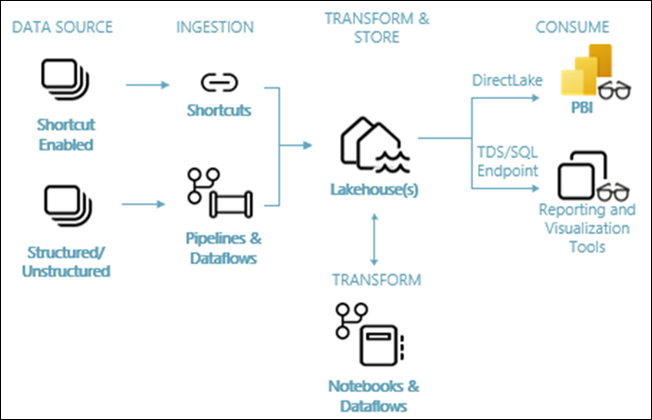

# Get data into Fabric Lakehouse

## Overall Estimated Duration: 8 Hours

## Overview

Traditionally, organizations used separate systems for structured data warehouses and unstructured data lakehouses, leading to silos and higher costs. Microsoft Fabric integrates these functions into a single platform, offering data movement, real-time analytics, and business intelligence with Delta Lake standardization to eliminate silos and reduce costs. It supports flexible implementations of lakehouse or data warehouse architectures. This tutorial demonstrates building a retail organization's lakehouse using a medallion architecture with raw, validated, and refined data layers, applicable across industries.

## Objective

Understand how to set up a Fabric workspace, build a lakehouse, ingest and transform data, and create reports. By the end of this lab, you will be able to:

- **Create a Fabric workspace** : Gain experience on creating and setting up a Fabric workspace, including understanding prerequisites and executing the workspace creation process.
- **Build a lakehouse** : Gain experience to build a lakehouse by activating SharePoint Online, creating the lakehouse, ingesting sample data, and building a report.
- **Ingest data into the lakehouse** : Gain knowledge on ingesting data into the lakehouse, focusing on the efficient and effective methods for data integration. 
- **Prepare and transform data in the lakehouse** : Gain experience to prepare and transform data within the lakehouse, focusing on data preparation techniques to ensure high-quality, actionable insights. This exercise covers essential practices for effective data transformation.
- **Building reports in Microsoft Fabric** : Gain experience to create and build reports in Microsoft Fabric, focusing on leveraging the platform's capabilities to generate actionable insights. This exercise involves designing and developing comprehensive reports.

### Data and transformation flow

This lab uses **Wide World Importers (WWI) sample data** to build this end-to-end lakehouse. In this implementation, the sample data is stored in an Azure Data storage account in Parquet file format for all the tables. However, in real-world scenarios, data would typically originate from various sources and in diverse formats.

The following image shows the source, destination and data transformation:

- **Data source:** The source data is in Parquet file format and in an unpartitioned structure. It's stored in a folder for each table. In this tutorial, we set up a pipeline to ingest the complete historical or one-time data to the lakehouse.
- **Lakehouse:** In this lab, you create a lakehouse, ingest data into the files section of the lakehouse, and then create delta lake tables in the Tables section of the lakehouse.
- **Transform:** For data preparation and transformation, you see two different approaches. We demonstrate the use of Notebooks/Spark for users who prefer a code-first experience and use pipelines/dataflow for users who prefer a low-code or no-code experience.
- **Consume:** To demonstrate data consumption, you see how you can use the DirectLake feature of Power BI to create reports, and dashboards and directly query data from the lakehouse.

## Pre-requisites

To effectively perform these exercises, you need basic knowledge of **Microsoft Azure**, **Microsoft Fabric**, **SharePoint Online**, and **data management principles**. Familiarity with creating and managing lakehouses, data ingestion, transformation, and reporting in Microsoft Fabric or Power BI is also required.

## Architecture

In this hands-on lab, the architecture flow shows the lakehouse end-to-end architecture. The components involved are described in the following list:

- **Data sources:** Fabric makes it quick and easy to connect to Azure Data Services, as well as other cloud-based platforms and on-premises data sources, for streamlined data ingestion.

- **Ingestion:** You can quickly build insights for your organization using more than 200 native connectors. These connectors are integrated into the Fabric pipeline and utilize the user-friendly drag-and-drop data transformation with dataflow. Additionally, with the Shortcut feature in Fabric, you can connect to existing data, without having to copy or move it.

- **Transform and store:** Fabric standardizes on Delta Lake format. This means all the Fabric engines can access and manipulate the same dataset stored in OneLake without duplicating data. This storage system provides the flexibility to build lakehouses using a medallion architecture or a data mesh, depending on your organizational requirements. You can choose between a low-code or no-code experience for data transformation, utilizing either pipelines/dataflows or notebook/Spark for a code-first experience.

- **Consume:** Power BI can consume data from the Lakehouse for reporting and visualization. Each Lakehouse has a built-in TDS/SQL endpoint, for easy connectivity and querying of data in the Lakehouse tables from other reporting tools. Additionally, when a Lakehouse is created, a corresponding secondary item called a Warehouse is automatically generated with the same name as the Lakehouse. It provides users with the TDS/SQL endpoint functionality.

## Architecture Diagram

   

   

## Explanation of Components

- **Microsoft Entra ID** : Microsoft Entra ID is a cloud-based identity and access management service that enables secure access to both external and internal resources. It allows users to seamlessly sign in to a wide range of applications, including Microsoft 365, the Azure portal, and other SaaS apps, as well as custom applications developed for an organization. By managing user identities and controlling access, Microsoft Entra ID enhances security and simplifies the user experience across various platforms and devices.

- **Microsoft Fabric** : Microsoft Fabric is a comprehensive analytics and data platform tailored for enterprises seeking an integrated solution. It covers all aspects of data management, including movement, processing, ingestion, transformation, real-time event routing, and reporting. The platform provides a full range of services, such as Data Engineering, Data Factory, Data Science, Real-Time Analytics, Data Warehousing, and Databases.

- **SharePoint Online** : SharePoint Online is a cloud-based service from Microsoft that facilitates collaboration, document management, and content sharing within organizations. It enables users to create, store, and manage web-based documents and data, offering tools for team sites, document libraries, and lists.

- **Fabric lakehouse** : Microsoft Fabric Lakehouse is a data architecture platform designed to store, manage, and analyze both structured and unstructured data in one unified location. It offers flexibility and scalability, enabling organizations to handle extensive data volumes through a range of tools and frameworks for processing and analysis. The platform integrates seamlessly with other data management and analytics tools, delivering a comprehensive solution for data engineering and analytics.

- **Power BI** : Power BI is a suite of software services, applications, and connectors that collaborate to transform disparate data sources into cohesive, visually engaging, and interactive insights. Whether your data comes from an Excel spreadsheet or a mix of cloud-based and on-premises data warehouses, Power BI enables you to seamlessly connect to these sources, uncover and visualize key information, and share insights with anyone you choose.

# Getting Started with the Lab
 
Once the environment is provisioned, a virtual machine (JumpVM) and lab guide will get loaded in your browser. Use this virtual machine throughout the workshop to perform the lab. You can see the number on the bottom of the Lab guide to switch to different exercises of the lab guide.
 
## Accessing Your Lab Environment
 
Once you're ready to dive in, your virtual machine and lab guide will be right at your fingertips within your web browser.
 
   

### Virtual Machine & Lab Guide
 
Your virtual machine is your workhorse throughout the workshop. The lab guide is your roadmap to success.
 
## Exploring Your Lab Resources
 
To get a better understanding of your lab resources and credentials, navigate to the **Environment** tab.
 

 
## Utilizing the Split Window Feature
 
For convenience, you can open the lab guide in a separate window by selecting the **Split Window** button from the top right corner.
 

 
## Managing Your Virtual Machine
 
Feel free to start, stop, or restart your virtual machine as needed from the **Resources** tab. Your experience is in your hands!
 

## **Lab Duration Extension**

1. To extend the duration of the lab, kindly click the **Hourglass** icon in the top right corner of the lab environment. 

    

    >**Note:** You will get the **Hourglass** icon when 10 minutes are remaining in the lab.

2. Click **OK** to extend your lab duration.
 
   

3. If you have not extended the duration prior to when the lab is about to end, a pop-up will appear, giving you the option to extend. Click **OK** to proceed.
 
## Let's Get Started with Azure Portal
 
1. On your virtual machine, click on the Azure Portal icon as shown below:
 
    
 
2. You'll see the **Sign into Microsoft Azure** tab. Here, enter your credentials:
 
   - **Email/Username:** <inject key="AzureAdUserEmail"></inject>
 
      
 
3. Next, provide your password:
 
   - **Password:** <inject key="AzureAdUserPassword"></inject>
 
      

1. If you see the pop-up **Action Required**, click **Ask Later**.
   
     

1. First-time users are often prompted to Stay Signed In, if you see any such pop-up, click on No.

1. If a **Welcome to Microsoft Azure** popup window appears, click **Cancel** to skip the tour.
    
     

1. Click **Next** from the bottom right corner to embark on your Lab journey!
 
    

In this hands-on lab, you'll learn to set up a Fabric workspace, build a lakehouse, ingest and transform data, and create reports. The lab covers workspace creation, data integration, preparation techniques, and report development using Microsoft Fabric.

### Known Issues

1. If you run into an issue where a file starts downloading (eg. file.html) in the VM or get stuck in between, refresh your browser and continue performing the lab:

   
 
1. Click Next from the bottom right corner to embark on your Lab journey!

Now you're all set to explore the powerful world of technology. Feel free to reach out if you have any questions along the way. Enjoy your workshop!

## Support Contact

The CloudLabs support team is available 24/7, 365 days a year, via email and live chat to ensure seamless assistance at any time. We offer dedicated support channels tailored specifically for both learners and instructors, ensuring that all your needs are promptly and efficiently addressed.

Learner Support Contacts:

- Email Support: labs-support@spektrasystems.com
- Live Chat Support: https://cloudlabs.ai/labs-support

## Happy Learning!!
