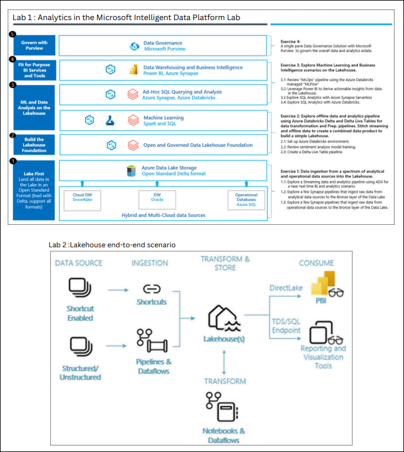
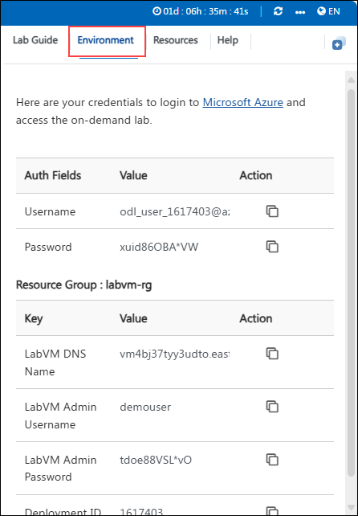
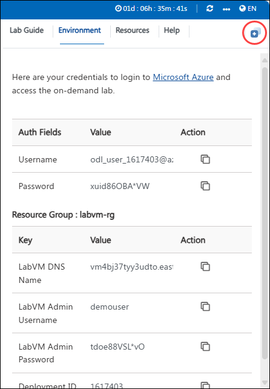
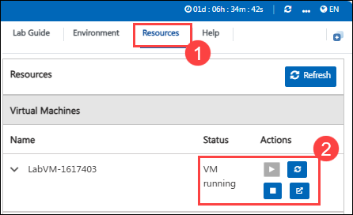

# Real Time Analytics with Synapse

### Overall Estimated Duration: 4 Hours

## Overview

This interactive lab begins with exploring an integrated Data Lakehouse foundation, focusing on data ingestion, transformation, and analytics using ADX, Synapse, Azure Databricks, and Microsoft Purview. It includes exercises for creating pipelines, combining data, and investigating ML and BI scenarios. Involves working with Microsoft Fabric, including creating a workspace, building a lakehouse, ingesting sample data, preparing and transforming data, and developing reports. This segment emphasizes hands-on experience with data handling and reporting in a Microsoft Fabric environment.

We have arranged this lab into two parts to provide a comprehensive understanding of the Microsoft Intelligent Data Platform. The first emphasizes building and leveraging Microsoft Fabric for advanced data analytics and reporting, and the second focuses on implementing an integrated Data Lakehouse foundation

## Objective

Understand how to unify data estates using the Microsoft Intelligent Data Platform and manage a Data Lakehouse with Microsoft Fabric. Learn data ingestion, transformation, and reporting for accelerated value creation. By the end of this lab, you will have knowledge on :

### Analytics in the Microsoft Intelligent Data Platform Lab

- **Data ingestion from a spectrum of analytical and operational data sources into the Lakehouse** : Learn to implement data ingestion pipelines using ADX for streaming data and Synapse pipelines to ingest raw data from analytical and operational sources into the Bronze layer of the Data Lake.
- **Explore offline data and analytics pipeline using open Delta format and Azure Databricks Delta Live Tables. Stitch streaming and non-streaming data (landed earlier) to create a combined data product to build a simple Lakehouse** : Learn to use the open Delta format and Azure Databricks Delta Live Tables for offline data and analytics pipelines.
- **Explore Machine Learning and Business Intelligence scenarios on the Lakehouse** : Learn to explore ML and BI scenarios on the Lakehouse using Azure Databricks MLflow, Power BI, and SQL Analytics with Azure Synapse Serverless and Databricks.

## Pre-requisites

- **Basic Understanding of Data Architecture**: Familiarity with data lakehouse and data warehouse concepts.
- **Microsoft Fabric Knowledge**: Basic knowledge of Microsoft Fabric and its components, including data integration, data engineering, and analytics services.

## Architecture

In this lab, the architecture covers two main aspects: first, it explores an integrated Data Lakehouse foundation using ADX, Synapse, and Azure Databricks for efficient data ingestion, transformation, and analytics, supporting ML and BI scenarios with governance by Microsoft Purview. Secondly, it delves into building and managing a unified data lakehouse with Microsoft Fabric, which includes creating a workspace, ingesting and preparing data, and leveraging Delta Lake for streamlined data processing and reporting through tools like Power BI.

## Architecture Diagram

## Explanation of Components

- **Azure Synapse Analytics** : Integrates data ingestion and transformation with serverless SQL and data pipelines, enabling seamless preparation and analysis of large datasets.
- **Azure Databricks** : Facilitates advanced data transformation and machine learning with Delta Live Tables and SQL analytics, optimizing data workflows and model training.
- **Microsoft Purview** : Ensures comprehensive data governance and cataloging, providing a unified view and management of the entire data estate.
- **Microsoft Fabric** : Offers a unified platform for data integration, transformation, and reporting, streamlining processes and reducing silos within the data ecosystem.
- **Power BI** : Enables interactive data visualization and reporting, allowing users to derive actionable insights from the data lakehouse.

- **Delta Lake** : Standardizes data storage with a unified format that supports reliable and scalable data processing across various analytics tools.

- **Lakehouse** : Combines the best features of data lakes and data warehouses, offering a unified data platform that supports both structured and unstructured data for comprehensive analytics, machine learning, and business intelligence.

- **Notebooks** : Provide an interactive environment for data exploration and analysis, allowing users to perform ad-hoc queries and visualize results using code or SQL.

- **Dataflows** : Enable the design and automation of data transformation processes within a visual interface, simplifying the ETL (Extract, Transform, Load) workflows.

- **Pipelines** : Orchestrate and automate data ingestion and processing tasks, integrating various data sources and ensuring smooth data movement through the analytics workflow.
- **Apache Spark** : Provides a powerful, distributed computing engine for large-scale data processing, supporting complex transformations and analytics with high performance and scalability

## Getting Started with the Lab
 
Welcome to your Analytics in the Microsoft Intelligent Data Platform with Microsoft Fabric Workshop! We've prepared a seamless environment for you to explore and learn about Azure services. Let's begin by making the most of this experience:
 
## Accessing Your Lab Environment
 
Once you're ready to dive in, your virtual machine and lab guide will be right at your fingertips within your web browser.

### Virtual Machine & Lab Guide
 
Your virtual machine is your workhorse throughout the workshop. The lab guide is your roadmap to success.
 
## Exploring Your Lab Resources
 
To get a better understanding of your lab resources and credentials, navigate to the **Environment** tab.
 

 
## Utilizing the Split Window Feature
 
For convenience, you can open the lab guide in a separate window by selecting the **Split Window** button from the Top right corner.
 

 
## Managing Your Virtual Machine
 
Feel free to start, stop, or restart your virtual machine as needed from the **Resources** tab. Your experience is in your hands!

### Known Issues

1. If you run into an issue where a file starts downloading (eg. file.html) in the VM or get stuck in between, refresh your browser and continue performing the lab:

   

2. If you come across the message: **RDP Gateway is in Running state. Please refresh after 1 or 2 minutes**. Please wait for 2 minutes and then navigate to **Resources Tab**, and click on the **Refresh button**:

   

   **Note:** If you are not using the environment, pause the VM by navigating to the **Resources Tab** and de-allocate it.

   

1. If you wish to start the environment or resume the lab, navigate to the **Resources Tab** and start it (It may take up to 5 minutes for the VM to be up and running).

     
   
   **Note:** If you are unable to proceed with the lab execution, here are the links to the click-by-click version of the lab to continue.   

   [click-by-click without story](https://content.cloudguides.com/guides/Analytics%20in%20MIDP%20-%20Interactive%20Experience)

   [click-by-click with story](https://content.cloudguides.com/guides/Analytics%20in%20MIDP%20-%20Interactive%20Experience%20with%20a%20story)

## Login to Azure Portal

1. In the JumpVM, click on the Azure portal shortcut of the Microsoft Edge browser which is created on the desktop.

   

1. When you click on Azure portal, the edge browser will ask you to sign in to sync data, click on **Start without your data**.

   

1. On the next window, click on **Continue without this data**.

   

1. On the next window, click on **Confirm and start browsing**.

   

1. Now, you will see three tabs in the Edge browser, close the tab named **Welcome to Microsoft Edge** and the other tab named **Welcome**.

1. On the **Sign in to Microsoft Azure** window, you will see the login screen. Enter the following username and click on **Next**.

   * Email/Username: <inject key="AzureAdUserEmail"></inject>

      

1. Now enter the following password and click on **Sign in**.

   * Password: <inject key="AzureAdUserPassword"></inject>

      

1. First-time users are often prompted to **Stay Signed In**, if you see this pop-up, click on **Yes**.

1. If you see the pop-up **Action Required**, keep default and then click on **Ask later**. If you see the pop-up **Help us protect your account**, click on **Skip for now(14 days until this is required)**, and then click on **Next**.

   

   >**NOTE:** Do not enable MFA, select **Ask Later**.

1. If you see the pop-up **You have free Azure Advisor recommendations!**, close the window to continue the lab.

1. If a **Welcome to Microsoft Azure** popup window appears, click **Maybe Later** to skip the tour.

1. In the search results pane, select **Resource groups**.

   

1. On the **Resource groups** page, you can view the pre-deployed resource group **analyticsSolution**.

   
 
1. Click Next from the bottom right corner to embark on your Lab journey!

Now you're all set to explore the powerful world of technology. Feel free to reach out if you have any questions along the way.

## Support Contact

The CloudLabs support team is available 24/7, 365 days a year, via email and live chat to ensure seamless assistance at any time. We offer dedicated support channels tailored specifically for both learners and instructors, ensuring that all your needs are promptly and efficiently addressed.

Learner Support Contacts:

- Email Support: cloudlabs-support@spektrasystems.com
- Live Chat Support: https://cloudlabs.ai/labs-support

### Happy Learning!!