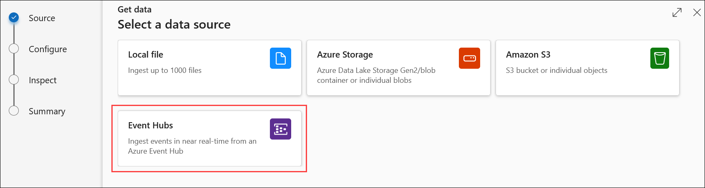

### Exercise 1 : Data ingestion from a spectrum of analytical and operational data sources into the Lakehouse.

### Estimated Duration: 1 Hour

In this exercise, you'll learn to ingest data from various sources, including databases and event streams, into the Synapse Lakehouse for centralized storage and processing.

## Lab Objectives

In this lab, you will perform:

- **Task 1**: Explore a Streaming data and analytics pipeline using ADX for a near real time analytics scenario.

## Task 1: Explore a Streaming data and analytics pipeline using ADX for a near real time analytics scenario.

In this task, you will use ADX to explore thermostat data from the stores streamed in near real-time to an Azure Event Hub.

1. In the search results pane, select **Resource groups**.

    

2. In the **Resource groups** page, in the filter box, enter: **analyticsSolution**.

3. In the filtered results, select the resource group that has a name starting with **analyticsSolution**.

    

4. In the resources filter box for resources, search for **app**.

5. In the filtered results, select the **App Service**.

    

6. Select **Browse** (on the top left). This action will start the data simulation required to execute this task successfully (this will take 3-5 mins).

   

   And, this will take you to a webpage that will confirm **Data Simulation** has started:

   

7. Return to the Azure Portal session by selecting the resource group from the top navigation bar.

    

8. In the resources filter box for resources, search for **Synapse**.

9. In the filtered results, select the **Azure Synapse resource**.

    

    >**Note:** You might see a Synapse workspace resource name with a different suffix in your Azure Portal.

10. In the Open Synapse Studio tile, select the Open link.

     

    >**Note:** Synapse Studio opens in a new web session (tab).

11. In Synapse Studio, on the left pane select the **Data (1)** hub icon and expand **Data Explorer Databases (Preview) (2)**.

12. Now expand the **analyticspool<inject key="DeploymentId"></inject> (3)** Data Explorer pool. Hover your curser and click on the **ellipses (4)** (the three dots next to the data explorer pool).

    

    >**Note:** If you do not see the ellipses, expand the Data pane by dragging it to the right.
 
13. Click on **Open in Azure Data Explorer (1)**.

       

       *This will open Azure Data Explorer in a new web session (tab).*

       *For this lab, an ADX pool has already been created in the Azure Synapse workspace.*

       *By using ADX’s powerful Kusto Query Language (KQL), you can ensure that the thresholds you have set for each device in the store are being met.*

       >**Note:** Other Azure services use KQL for analytical queries. These services include Azure Monitor logs, Application Insights, and Microsoft Defender for Endpoint.

       >**Note:** Select **Dismiss** if any pop-up appears on your screen.
       
16. Once Azure Data Explorer Studio is launched, you will be triggered with a prompt to add a connection then click on **trust** button.

    

17. In Azure Data Explorer Studio, click on the **Home** section in the left pane, and click on **Get Data** button.

     

18. On the **Get Data**, select **Event Hub** data source button.

     
     
19. You should be able to see the connection is already listed.

20. Click on the **+** button for creating a new table, and name it as **Thermostat (1)**. From **Configure the data source** page, choose the default **subscription (2)** from the dropdown list in the Subscription section. 

21. In the **Event Hub namespace** dropdown list, select Event Hub that has a name starting with **adx-thermostat-occupancy-<inject key="DeploymentId"></inject> (3)**.

26. In the **Event Hubs** dropdown list, select **thermostat (4)**.

27. In the **Consumer group** dropdown list, select **$Default (5)**.

28. In the **Data connection name** dropdown list, select **thermostat_Default (6)**.

29. Click on **Next**.   

    

30. In the **Inspect the data** tab, wait until the data preview loads (about 20 seconds).

31. Review the event data, which comprises thermostat measures from different devices.

32. In the **Data** format, ensure **JSON** is selected.

33. Click on **Finish**.  

     

34. Confirm that the continuous ingestion from Event Hub has been established, and then click on **Close** (located at the bottom of the page).

    

34. Return to the Synapse Studio web session (tab).

35. In Synapse Studio, at the left, select the **Develop** hub icon (the third from the top).

36. In the **Develop** pane, expand **KQL scripts**.

37. Select the **ThermostatOccupancyScript** script.

    

38. In the **Connect to** dropdown list select the data explorer pool starting with **analyticspool-**.

    >**Note:** If you do not see this option, click on the ellipsis [...] next to Publish on the top bar.

    >**Note:** If required, collapse the panes on the left using the << icon at the top right of each pane.

39. Once the data explorer pool is selected you should see its automatically selecting **AnalyticsDB**.

    >**Note:** If it is not automatically selected, from the dropdown select the **AnalyticsDB**.

40. Select the query (lines 4-8) that is commented as **What is the average temp every minute?**.

    *The query retrieves the average temperature per minute for a thermostat device (TH005) for        the Miami store.*

40. Select **Run**. 

41. In the **Results** pane (located along the bottom), review the query result expressed as a chart. Please note that it may take upto 2-3 minutes to accumulate data. If you do not see any result please re-run query after sometime. 

       

    >**Note:** If you dont see data in the query result, wait for few minutes and try again since        the data will take a few minutes to start streaming. In case your query returns an error,         chances are that the thermostat table was not created successfully in previous steps. You         may have to create that table with a different name e.g. Thermostat1, update the KQL query        accordingly and re-execute the KQL query.  

    *Your graph may appear slightly different than the one shown above. It may take up to 60           seconds to load.*

42. Notice that the temperature in the Miami store is oscillating between 65 and 70 degrees Fahrenheit. Based on these insights, we are able to adjust the temperatures to optimal level.

## Summary

In this exercise, we set up a streaming data pipeline using Azure Data Explorer (ADX), ingested streaming data, and performed real-time analytics to gain immediate insights. This demonstrated efficient processing of high-volume data for time-sensitive scenarios.

### You have successfully completed this exercise.
